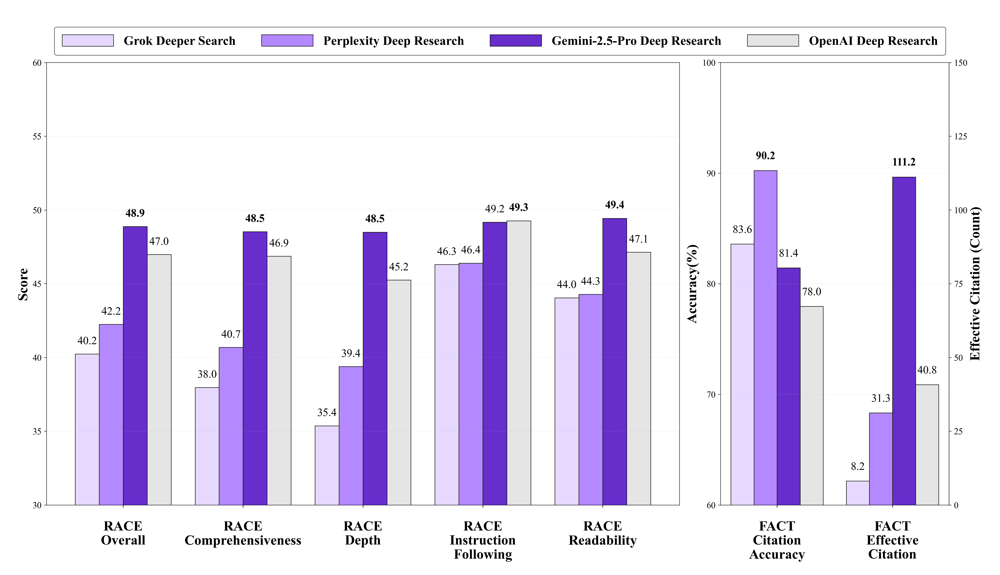
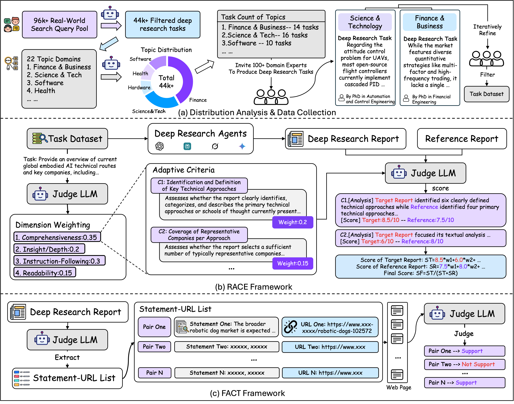

# DeepResearch Bench: A Comprehensive Benchmark for Deep Research Agents

📃 [Website](https://deepresearch-bench.github.io/) • 📄 [Paper](#) • 🏆 [Leaderboard](https://deepresearch-bench.github.io/) • 📊 [Dataset](#) 




## 📖 Overview

DeepResearch Bench addresses the absence of a comprehensive benchmark for systematically evaluating Deep Research Agents (DRAs). Our benchmark consists of **100 PhD-level research tasks**, each meticulously crafted by domain experts across **22 distinct fields**, including:

* 🔬 **Science & Technology**: Physics, chemistry, biology, environmental science, and engineering
* 💼 **Finance & Business**: investments, personal finance, marketing, and human resources
* 💻 **Software**: Topics related to the use of software and the internet
* 🌍 **Others**: Art & Design, Entertainment, History, Industrial, Transportation, Travel, and more

## Benchmark Construction

### Topic Distribution Analysis

To ensure DeepResearch Bench reflects real-world research demands, we analyzed **96,147 anonymized user queries** from web search-enabled LLM interactions.These queries were classified into **22 topic domains** based on the WebOrganizer taxonomy, revealing the authentic distribution of human deep research needs across different fields.

### Expert Task Collection

Guided by real-world demand distribution, we invited **PhD-level experts and senior practitioners** (5+ years experience) to design challenging research tasks within their domains. Each submission underwent rigorous manual screening for:

- **Quality**: High research standards and complexity
- **Clarity**: Clear task definitions and requirements  
- **Authenticity**: Grounded in real research scenarios
- **Challenge Level**: Testing upper limits of DRA capabilities

This process yielded **100 high-quality benchmark tasks** (50 Chinese, 50 English) that maintain the same topical balance as observed in real-world usage.


## Evaluation Framework



DeepResearch Bench introduces two complementary evaluation methodologies designed to comprehensively assess Deep Research Agents:

### 🎯 RACE (Reference-based Adaptive Criteria-driven Evaluation)

RACE evaluates **report generation quality** through a sophisticated multi-step process:

- **Dynamic Criteria Generation**: Automatically generates task-specific evaluation criteria across four key dimensions:
  - 📚 **Comprehensiveness**: Coverage breadth and depth of the research topic
  - 🔍 **Insight/Depth**: Quality of analysis and insight generation  
  - 📋 **Instruction-Following**: Adherence to specific task requirements
  - 📖 **Readability**: Clarity, organization, and presentation quality

- **Reference-Based Scoring**: Compares target reports against high-quality reference reports to ensure discriminative evaluation
- **Weighted Assessment**: Uses dynamic weights adapted to each task's specific requirements

### 🔗 FACT (Framework for Factual Abundance and Citation Trustworthiness)

FACT evaluates **information retrieval and grounding capabilities** through:

- **Statement-URL Extraction**: Automatically extracts factual claims and their cited sources from generated reports
- **Deduplication**: Removes redundant statement-URL pairs to focus on unique factual claims
- **Support Verification**: Uses web scraping and LLM judgment to verify whether cited sources actually support the claims
- **Citation Metrics**: Calculates:
  - **Citation Accuracy**: Percentage of correctly supported citations
  - **Effective Citations**: Average number of verifiably supported citations per task


## 📊 Evaluation Results

### Main Results

Our comprehensive evaluation reveals significant performance variations across different model architectures and approaches:

| **Model** | **RACE Overall** | **RACE Comp.** | **RACE Depth** | **RACE Inst.** | **RACE Read.** | **FACT C. Acc.** | **FACT E. Cit.** |
|-----------|------------------|----------------|----------------|----------------|----------------|------------------|------------------|
| ***LLM with Search Tools*** |
| **Claude-3.7-Sonnet w/Search** | **40.67** | **38.99** | **37.66** | **45.77** | 41.46 | 93.68 | 32.48 |
| Claude-3.5-Sonnet w/Search | 28.48 | 24.82 | 22.82 | 35.12 | 35.08 | **94.04** | 9.78 |
| Perplexity-Sonar-Reasoning-Pro(high) | 40.22 | 37.38 | 36.11 | 45.66 | **44.74** | 39.36 | 8.35 |
| Perplexity-Sonar-Reasoning(high) | 40.18 | 37.14 | 36.73 | 45.15 | 44.35 | 48.67 | 11.34 |
| Perplexity-Sonar-Pro(high) | 38.93 | 36.38 | 34.26 | 44.70 | 43.35 | 78.66 | 14.74 |
| Perplexity-Sonar(high) | 34.54 | 30.95 | 27.51 | 42.33 | 41.60 | 74.42 | 8.67 |
| Gemini-2.5-Pro-Grounding | 35.12 | 34.06 | 29.79 | 41.67 | 37.16 | 81.81 | 32.88 |
| Gemini-2.5-Flash-Grounding | 32.39 | 31.63 | 26.73 | 38.82 | 34.48 | 81.92 | 31.08 |
| GPT-4o-Search-Preview (high) | 35.10 | 31.99 | 27.57 | 43.17 | 41.23 | 88.41 | 4.79 |
| GPT-4o-Mini-Search-Preview(high) | 31.55 | 27.38 | 22.64 | 40.67 | 39.91 | 84.98 | 4.95 |
| GPT-4.1 w/Search(high) | 33.46 | 29.42 | 25.38 | 42.33 | 40.77 | 87.83 | 4.42 |
| GPT-4.1-mini w/Search(high) | 30.26 | 26.05 | 20.75 | 39.65 | 39.33 | 84.58 | 4.35 |
| ***Deep Research Agent*** |
| Grok Deeper Search | 40.24 | 37.97 | 35.37 | 46.30 | 44.05 | 83.59 | 8.15 |
| Perplexity Deep Research | 42.25 | 40.69 | 39.39 | 46.40 | 44.28 | **90.24** | 31.26 |
| **Gemini-2.5-Pro Deep Research** | **48.88** | **48.53** | **48.50** | 49.18 | **49.44** | 81.44 | **111.21** |
| OpenAI Deep Research | 46.98 | 46.87 | 45.25 | **49.27** | 47.14 | 77.96 | 40.79 |

**Key Findings:**
- **Gemini-2.5-Pro Deep Research** achieves the highest overall performance (48.88) with exceptional depth and comprehensiveness
- **Deep Research Agents** significantly outperform traditional LLMs with search tools
- **Citation accuracy** varies substantially across models, with Claude-3.5-Sonnet achieving 94.04% accuracy
- **Effective citation count** shows Gemini-2.5-Pro leading with 111.21 citations per task

---

## 🛠️ Installation and Usage

### Prerequisites

- Python 3.9+
- Gemini API key (for LLM evaluation)
- Jina API key (for web scraping in FACT evaluation)

### Setup

```bash
git clone https://github.com/your-username/deep_research_bench.git
cd deep_research_bench
pip install -r requirements.txt
```

### API Configuration

Set the required API keys as environment variables:

```bash
# Set Gemini API key for LLM evaluation
export GEMINI_API_KEY="your_gemini_api_key_here"

# Set Jina API key for web scraping
export JINA_API_KEY="your_jina_api_key_here"
```


## Project Structure

```
deep_research_bench/
├── data/
│   ├── criteria_data/      # Evaluation criteria data
│   ├── prompt_data/        
│   │   └── query.jsonl     # ← 100 benchmark queries for your agent
│   └── test_data/          
│       ├── cleaned_data/   # Cleaned article data
│       └── raw_data/       # ← Put your model outputs here (model_name.jsonl)
├── prompt/                 # Prompt templates
├── utils/                  # Utility functions
├── deepresearch_bench_race.py  # RACE evaluation script
├── run_benchmark.sh        # ← Add your model names here, then run
└── requirements.txt        # Dependencies
```

**Quick Start Flow:**
1. Use queries from `data/prompt_data/query.jsonl` → Run your Deep Research Agent
2. Save outputs to `data/test_data/raw_data/<model_name>.jsonl`
3. Add model name to `TARGET_MODELS` in `run_benchmark.sh`
4. Run: `bash run_benchmark.sh`

## Quick Start

### 1. Prepare Your Model Data

Run your Deep Research Agent on the benchmark queries and save outputs in the required format:

**Input**: Use queries from `data/prompt_data/query.jsonl` (100 benchmark tasks)

**Output**: Save results to `data/test_data/raw_data/<model_name>.jsonl`

**Required format** (each line should contain):
```json
{
    "id": "task_id", 
    "prompt": "original_query_text", 
    "article": "generated_research_article_with_citations"
}
```

### 2. Configure Models to Evaluate

Edit `run_benchmark.sh` and add your model name:
```bash
TARGET_MODELS=("your-model-name")
```

### 3. Run Evaluation

```bash
bash run_benchmark.sh
```

Results will be saved to:
- RACE evaluation: `results/race/<model_name>/race_result.txt`
- FACT evaluation: `results/fact/<model_name>/fact_result.txt`

### Custom LLM Integration

If you're not using the official Gemini API or want to use other LLMs for evaluation, modify the `AIClient` class in `utils/api.py` to implement your custom LLM interface.

## Citation

If you use DeepResearch Bench in your research, please cite our paper:

```bibtex
@article{du2025deepresearch,
  author    = {Mingxuan Du and Benfeng Xu and Chiwei Zhu and Xiaorui Wang and Zhendong Mao},
  title     = {DeepResearch Bench: A Comprehensive Benchmark for Deep Research Agents},
  journal   = {arXiv preprint},
  year      = {2025},
}
``` 